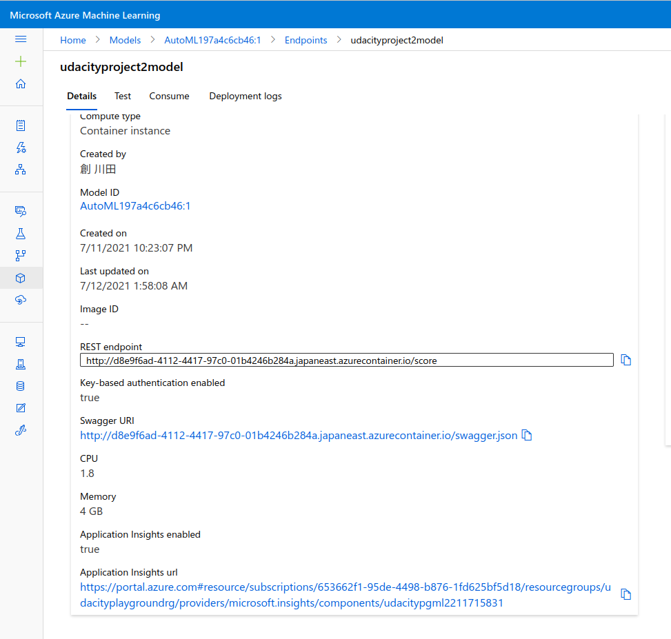
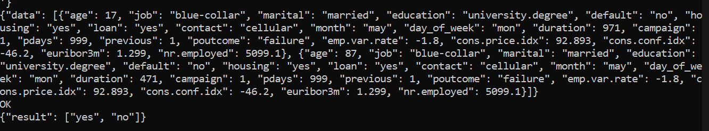
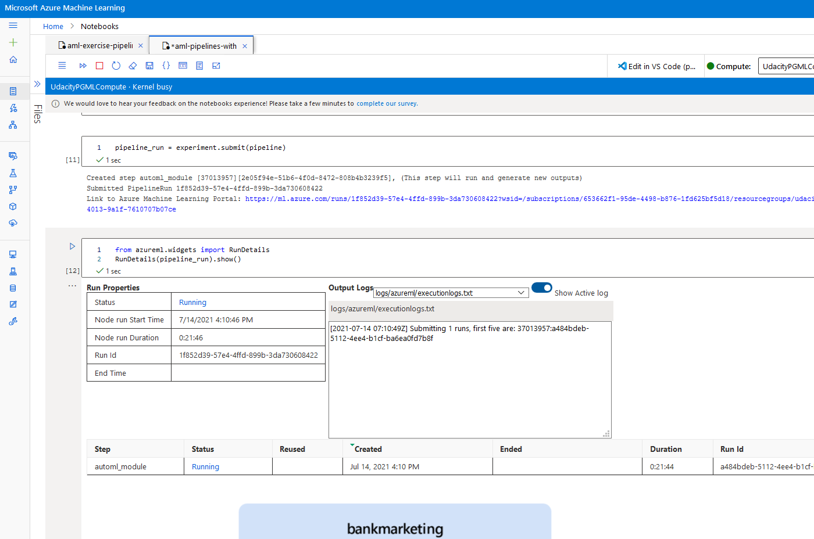

service principle created

az ml workspace share worked

App Insights

Swagger is also there

enpoint.py

Scheduled run

Dataset

Pipeline running with Jupyter notebook

In the ML Studio

Piepline endpoints

Published pipeline
